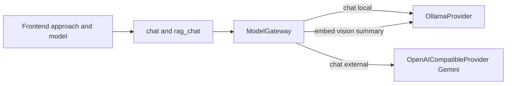

# E2 Model Gateway — Gemini Chat Baseline

## Status

Planned 2026-07-14. Implementation not started.

## Decisions

- External baseline: **Google Gemini** via OpenAI-compatible API  
  (`https://generativelanguage.googleapis.com/v1beta/openai/`)
- Env secret: `GEMINI_API_KEY` from Google AI Studio (free tier)
- Default external chat model: `gemini-2.5-flash` (confirm current free Flash id at implement time)
- E2.1 scope: **chat / RAG generation only**
- Stay on Ollama: embeddings, vision digests, conversation summary
- Frontend `approach` becomes real backend routing:
  - `local_only` → Ollama chat
  - `openapi` → Gemini chat
  - `hybrid` → Ollama chat primary, Gemini fallback on outage/overload

## Why not free OpenAI key

OpenAI no longer offers a free production API key. Use Gemini free tier (or later Groq/OpenRouter) through one OpenAI-compatible adapter.

## Architecture (E2.1)

## Implementation steps

1. Journal + plan docs (this file / enterprise plan) — done in same docs commit.
2. Add `LLMProvider` protocol (`generate`, `embed`, `health`) mirroring current `OllamaClient`.
3. Wrap existing client as `OllamaProvider`.
4. Add `OpenAICompatibleProvider` for Gemini base URL + API key.
5. Add `ModelGateway.resolve(model_id, approach, capability)` + small registry.
6. Wire gateway into `POST /chat` and `POST /rag/chat` generation only.
7. Persist real `provider` in chat exchange metadata.
8. Config/`.env.example`: `GEMINI_API_KEY`, `GEMINI_BASE_URL`, `GEMINI_CHAT_MODEL`.
9. Frontend: expose Gemini model option when `openapi`/`hybrid`; keep local list for Ollama.
10. Tests: unit gateway routing; optional live smoke with key.

## Out of scope for E2.1

- External embeddings / vision
- Per-tenant DB allowlist
- Groq/OpenRouter adapters (same provider class later)
- Paid OpenAI official API

## Key files

- `backend/app/services/ollama_client.py` — current monolithic client
- `backend/app/main.py` — composition root + chat/rag endpoints
- `backend/app/services/rag_service.py` — generation caller
- `frontend/src/entities/model/model.ts` — `approach` already defined
- `research/ENTERPRISE_PRODUCT_EXPANSION_PLAN.md` — E2 section
