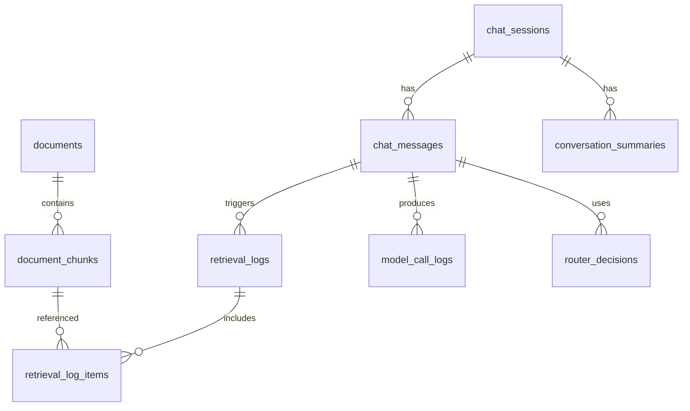

# PostgreSQL Schema

PostgreSQL хранит состояние приложения, историю, связи с Qdrant и диагностические данные. Векторы живут в Qdrant, но Postgres отвечает за наблюдаемость и воспроизводимость RAG-ответов.

## Основные Правила

- Qdrant хранит vectors и payload.
- Postgres хранит документы, chunks, sessions, messages, logs и benchmark results.
- Каждый Qdrant point должен иметь связь с `document_chunks.id`.
- Каждый chat response должен быть воспроизводим: какие chunks нашли, какая модель отвечала, какой router decision был принят.

## ER Overview



## Таблица `documents`

Исходные документы до нарезки на chunks.

```sql
create table documents (
    id uuid primary key default gen_random_uuid(),
    external_id text unique,
    title text not null,
    source_type text not null,
    source_path text not null,
    domain text not null,
    language text not null default 'ru',
    content_hash text not null,
    metadata jsonb not null default '{}'::jsonb,
    created_at timestamptz not null default now(),
    ingested_at timestamptz
);
```

Примеры `domain`:

- `tech_knowledge`;
- `user_feedback`;
- `business_metrics`;
- `release_notes`;
- `product_requirements`.

## Таблица `document_chunks`

Связь между исходным документом и Qdrant point.

```sql
create table document_chunks (
    id uuid primary key default gen_random_uuid(),
    document_id uuid not null references documents(id) on delete cascade,
    qdrant_collection text not null,
    qdrant_point_id text not null,
    chunk_index integer not null,
    content text not null,
    token_count integer,
    feature text[] not null default '{}',
    persona_relevance text[] not null default '{}',
    metadata jsonb not null default '{}'::jsonb,
    created_at timestamptz not null default now(),
    unique (qdrant_collection, qdrant_point_id)
);
```

Зачем хранить `content` и в Postgres, если он есть в Qdrant payload:

- проще дебажить retrieval;
- можно восстановить prompt;
- можно пересобрать Qdrant collection;
- можно анализировать chunks без обращения к vector DB.

## Таблица `chat_sessions`

Сессии пользователя.

```sql
create table chat_sessions (
    id uuid primary key default gen_random_uuid(),
    title text,
    active_persona text not null default 'PO',
    metadata jsonb not null default '{}'::jsonb,
    created_at timestamptz not null default now(),
    updated_at timestamptz not null default now()
);
```

`active_persona` на первом этапе не является системой прав доступа. Это часть prompt/context.

Допустимые значения:

- `PO`;
- `PM`;
- `Developer`;
- `Support Manager`.

## Таблица `chat_messages`

Сообщения пользователя и ассистента.

```sql
create table chat_messages (
    id uuid primary key default gen_random_uuid(),
    session_id uuid not null references chat_sessions(id) on delete cascade,
    role text not null,
    content text not null,
    persona text,
    model_name text,
    metadata jsonb not null default '{}'::jsonb,
    created_at timestamptz not null default now()
);
```

Примеры `role`:

- `user`;
- `assistant`;
- `system`;
- `tool`.

## Таблица `conversation_summaries`

Сжатая память длинных диалогов.

```sql
create table conversation_summaries (
    id uuid primary key default gen_random_uuid(),
    session_id uuid not null references chat_sessions(id) on delete cascade,
    summary text not null,
    covered_message_from uuid references chat_messages(id),
    covered_message_to uuid references chat_messages(id),
    model_name text,
    metadata jsonb not null default '{}'::jsonb,
    created_at timestamptz not null default now()
);
```

Summary должно хранить:

- цель пользователя;
- важные решения;
- ограничения;
- открытые вопросы;
- релевантные фичи;
- текущую persona.

## Таблица `retrieval_logs`

Один retrieval-запуск для конкретного пользовательского сообщения.

```sql
create table retrieval_logs (
    id uuid primary key default gen_random_uuid(),
    message_id uuid not null references chat_messages(id) on delete cascade,
    query text not null,
    query_embedding_model text not null,
    strategy text not null,
    filters jsonb not null default '{}'::jsonb,
    top_k integer not null,
    latency_ms integer,
    created_at timestamptz not null default now()
);
```

Примеры `strategy`:

- `single_collection_vector`;
- `multi_collection_vector`;
- `metadata_filter_then_vector`;
- `hybrid_search`.

## Таблица `retrieval_log_items`

Конкретные chunks, найденные retrieval.

```sql
create table retrieval_log_items (
    id uuid primary key default gen_random_uuid(),
    retrieval_log_id uuid not null references retrieval_logs(id) on delete cascade,
    chunk_id uuid references document_chunks(id),
    qdrant_collection text not null,
    qdrant_point_id text not null,
    rank integer not null,
    score double precision,
    used_in_prompt boolean not null default true,
    metadata jsonb not null default '{}'::jsonb
);
```

Эта таблица помогает ответить на вопрос: "Почему модель ответила именно так?"

## Таблица `model_call_logs`

Логи вызовов LLM.

```sql
create table model_call_logs (
    id uuid primary key default gen_random_uuid(),
    message_id uuid references chat_messages(id) on delete cascade,
    provider text not null default 'ollama',
    model_name text not null,
    prompt_tokens integer,
    completion_tokens integer,
    total_tokens integer,
    latency_ms integer,
    cold_start boolean,
    success boolean not null default true,
    error_message text,
    metadata jsonb not null default '{}'::jsonb,
    created_at timestamptz not null default now()
);
```

Важно логировать `cold_start`, чтобы сравнивать первое обращение к модели и повторные вызовы.

## Таблица `router_decisions`

Решения model router.

```sql
create table router_decisions (
    id uuid primary key default gen_random_uuid(),
    message_id uuid not null references chat_messages(id) on delete cascade,
    router_mode text not null,
    complexity text not null,
    intent text,
    selected_model text not null,
    confidence double precision,
    reason text,
    features text[] not null default '{}',
    collections text[] not null default '{}',
    metadata jsonb not null default '{}'::jsonb,
    created_at timestamptz not null default now()
);
```

Примеры `router_mode`:

- `manual`;
- `rules`;
- `embedding`;
- `fine_tuned_classifier`.

Примеры `complexity`:

- `low`;
- `medium`;
- `high`.

## Таблица `answer_feedback`

Оценка ответов пользователем. Можно добавить после MVP.

```sql
create table answer_feedback (
    id uuid primary key default gen_random_uuid(),
    assistant_message_id uuid not null references chat_messages(id) on delete cascade,
    rating integer,
    is_grounded boolean,
    comment text,
    metadata jsonb not null default '{}'::jsonb,
    created_at timestamptz not null default now()
);
```

## Таблица `ingestion_runs`

История загрузок данных.

```sql
create table ingestion_runs (
    id uuid primary key default gen_random_uuid(),
    source_root text not null,
    target_collection text not null,
    status text not null,
    documents_count integer not null default 0,
    chunks_count integer not null default 0,
    errors_count integer not null default 0,
    started_at timestamptz not null default now(),
    finished_at timestamptz,
    metadata jsonb not null default '{}'::jsonb
);
```

## Таблица `benchmark_runs`

Результаты research-экспериментов.

```sql
create table benchmark_runs (
    id uuid primary key default gen_random_uuid(),
    benchmark_type text not null,
    name text not null,
    config jsonb not null default '{}'::jsonb,
    results jsonb not null default '{}'::jsonb,
    notes text,
    created_at timestamptz not null default now()
);
```

Примеры `benchmark_type`:

- `model_latency`;
- `router_accuracy`;
- `retrieval_quality`;
- `qdrant_ingest_batch_size`;
- `cpu_pinning`.

## Индексы

Минимальные индексы:

```sql
create index idx_documents_domain on documents(domain);
create index idx_documents_source_type on documents(source_type);
create index idx_document_chunks_document_id on document_chunks(document_id);
create index idx_document_chunks_feature on document_chunks using gin(feature);
create index idx_document_chunks_persona on document_chunks using gin(persona_relevance);
create index idx_chat_messages_session_id_created_at on chat_messages(session_id, created_at);
create index idx_retrieval_logs_message_id on retrieval_logs(message_id);
create index idx_retrieval_items_log_rank on retrieval_log_items(retrieval_log_id, rank);
create index idx_model_call_logs_model_name on model_call_logs(model_name);
create index idx_router_decisions_message_id on router_decisions(message_id);
```

## Что Нужно Для M1

Для первого MVP достаточно реализовать:

- `documents`;
- `document_chunks`;
- `chat_sessions`;
- `chat_messages`;
- `retrieval_logs`;
- `retrieval_log_items`;
- `model_call_logs`.

Для M3/M4:

- `router_decisions`;
- поле `active_persona` в `chat_sessions`;
- поле `persona` в `chat_messages`.

Для research:

- `ingestion_runs`;
- `benchmark_runs`;
- `answer_feedback`.

## Проверки Целостности

Перед production-like demo нужно проверять:

- каждый `document_chunk` имеет существующий `document_id`;
- каждый Qdrant point имеет `document_id` и `chunk_id`;
- каждый assistant response имеет `model_call_logs`;
- каждый RAG response имеет `retrieval_logs`;
- если router включен, каждый user message имеет `router_decisions`;
- если persona выбрана, она попадает и в session, и в prompt metadata.
